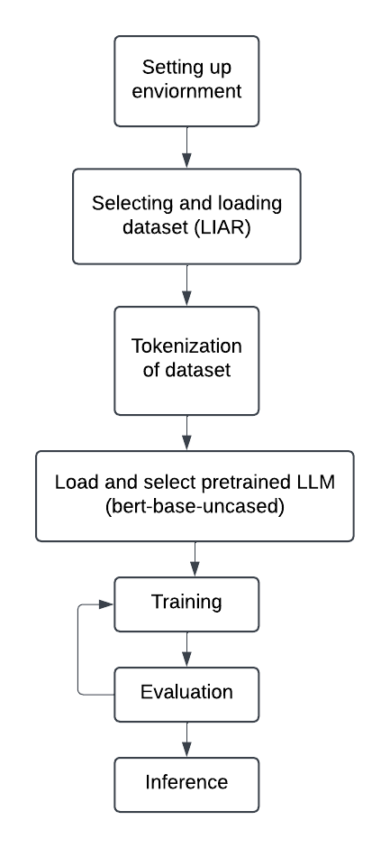

# **Factify: Fine-Tuning LLM for Fake News Detection**

Factify is a project designed to explore fine-tuning large language models (LLMs) for detecting fake news. It leverages the LIAR dataset to classify statements into six categories of truthfulness. This project serves as a learning exercise to understand the workflow of fine-tuning LLMs and applying them to practical tasks.

---

## **Project Structure**
The project is organized into the following directories:

1. **`docs/`**  
   Contains a detailed PDF document explaining the workflow of the project.
   - `workflow.pdf`

2. **`images/`**  
   Contains visual resources, including the flowchart representing the project's process.  
   - `flowchart.png`

3. **`scripts/`**  
   Contains the scripts for training and inference:  
   - `training.ipynb`: Jupyter Notebook to fine-tune the model.  
   - `inference.py`: Python script for running inference with the trained model.

---

## **Workflow Overview**
Below is the flowchart depicting the process of building Factify:



### **Steps**:
1. **Load Dataset**: Use the LIAR dataset containing statements with labeled truthfulness categories.  
2. **Preprocess**: Tokenize the dataset to make it compatible with BERT input requirements.  
3. **Fine-Tune Model**: Use the pre-trained `bert-base-uncased` model and fine-tune it on the LIAR dataset.  
4. **Train Model**: Train the model using the provided `training.ipynb`.  
5. **Evaluate**: Measure the model's performance on the validation and test datasets.  
6. **Run Inference**: Use `inference.py` to classify new statements with the trained model.

---

## **How to Use**

### **Training the Model**
1. Open the Jupyter Notebook `training.ipynb` in the `scripts/` directory.
2. Run the cells sequentially to:
   - Load and preprocess the dataset.
   - Fine-tune the BERT model.
   - Save the trained model weights.

### **Inference with Trained Weights**
1. Ensure the trained model weights are saved (generated by running the training script).  
2. Run `inference.py` by executing:
   ```bash
   python inference.py
   ```
3. Input a statement to classify it into one of the six truthfulness categories.

---

## **Purpose**
This project is primarily for **learning purposes**, aimed at understanding the following:
- The workflow of fine-tuning LLMs.
- Applying LLMs to classification problems like fake news detection.
- Exploring the use of datasets like LIAR with transformer models.

---

## **Technologies Used**
- **Transformers (Hugging Face)**: For working with pre-trained models like BERT.
- **PyTorch**: For training and fine-tuning the model.
- **LIAR Dataset**: For supervised training on labeled statements.

---

## **Future Work**
- Experiment with other transformer architectures for improved performance.
- Integrate Factify into a web-based or command-line application for real-world usage.
- Explore additional datasets to enhance model robustness.

